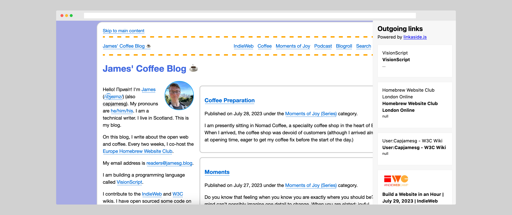

# webmemex.js

Create a sidebar with the outgoing links on a page.

[Read the documentation.](https://capjamesg.github.io/webmemex.js/)

## License

This project is licensed under an [MIT License](LICENSE.md).

## Contributors

- capjamesg